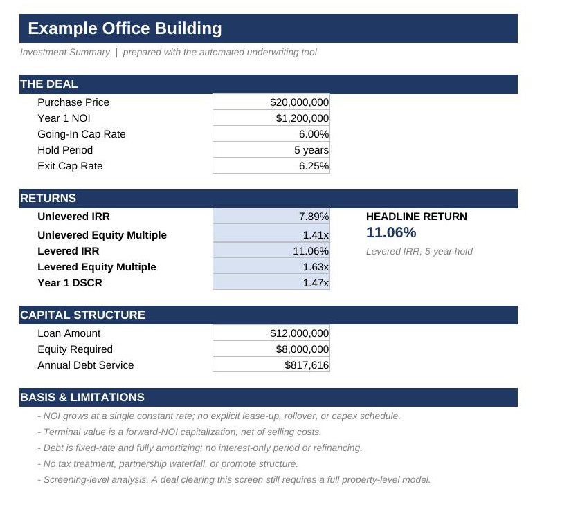
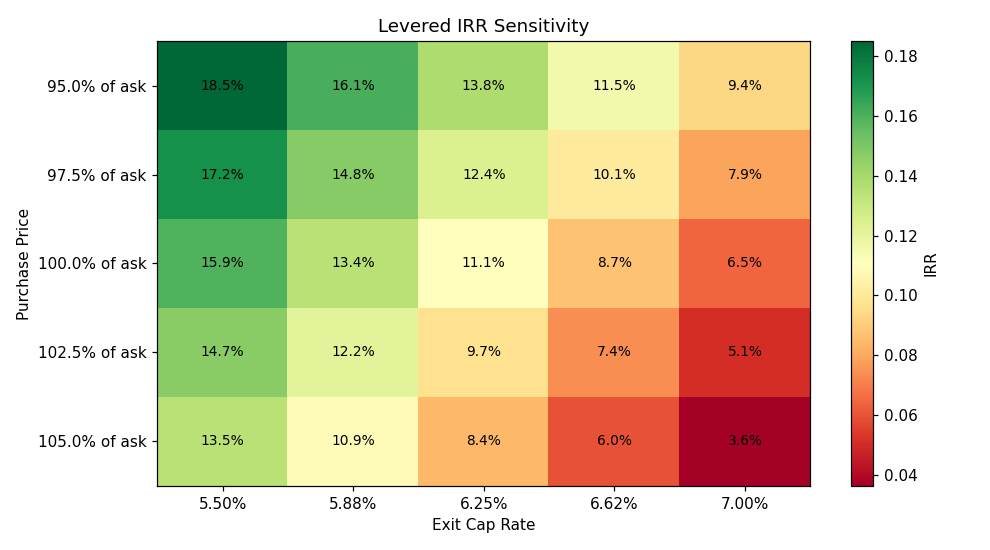

# Automated Real Estate Underwriting Tool

Underwrites a commercial real estate deal end to end and produces a client-ready
deliverable package: a levered and unlevered DCF model, IRR / equity multiple / DSCR,
a 25-scenario sensitivity grid, and a drafted investment memo.

Built by **Andrew Brown** - [dealroutes.com](https://dealroutes.com)

[](https://colab.research.google.com/github/AndrewBrownFinance/re-underwriting-tool/blob/main/Underwriting_Tool.ipynb)
### Run it in your browser — no setup

**[Open the live tool →](https://dealroutes.com/underwriting)**

A hosted version of this model runs entirely in the browser. Enter a deal, get returns,
a sensitivity grid, and a drafted memo. Nothing to install.

The notebook in this repository is the reference implementation: same math, plus batch
deal screening and the formatted Excel export.


---

## What it produces

The Excel export is a **live model**, not a static report. The yellow cells on the
Assumptions tab are inputs; every downstream figure is a real Excel formula that
recalculates when you change them.



Sensitivity analysis rebuilds the full model across 25 price and exit-cap combinations:



Example output is included: `Example_Underwriting_Model.xlsx` is a six-tab workbook
(Executive Summary, Assumptions, Cash Flow Model, Sensitivity, Deal Screen, Investment
Memo), alongside a formatted Word memo.

---

## Try it with your own numbers

**No install — run it in the browser.** Click the *Open in Colab* badge above, edit the
`DEAL` box in Section 2, then Runtime → Run all. Nothing to download.

**Or just use the Excel file.** `Example_Underwriting_Model.xlsx` is a live model. Open
the Assumptions tab, type over the yellow input cells, and every figure recalculates —
no Python required.

**Or run it locally.** Open `Underwriting_Tool.ipynb` in Jupyter. Run Section 0 (it
installs anything missing), edit the `DEAL` box, then Run All. The notebook is
self-contained — it is the only file you need.

```python
DEAL = {
    "deal_name":      "Example Office Building",
    "purchase_price":  20_000_000,
    "going_in_noi":     1_200_000,
    "exit_cap_rate":    0.0625,
    "ltv":              0.60,
}
```

Section 7 runs a list of deals in batch and ranks them by IRR — point it at a CSV or a
database query with the same field names.

Optional: for AI-drafted memos, `pip install anthropic` and set an `ANTHROPIC_API_KEY`
environment variable. Without it the notebook falls back to a deterministic template
memo and everything still runs.

---

## How the AI is used

Python computes every number. The language model receives only a block of
already-calculated figures and converts them to prose, under an explicit instruction not
to invent facts. The exact input sent to the model is printed in the notebook so it can
be audited before the output is trusted.

That separation is deliberate: the arithmetic stays reproducible and verifiable, and the
model is confined to the task it is actually reliable at.

---

## Validation

Excel formula output was cross-checked cell by cell against the Python engine. All
figures tie:

| | Python | Excel |
|---|---|---|
| Unlevered IRR | 7.8909% | 7.8909% |
| Levered IRR | 11.0575% | 11.0575% |
| Terminal Value | $21,812,901 | $21,812,901 |
| Year 1 DSCR | 1.4677x | 1.4677x |

---

## Assumptions and limitations

- NOI grows at a single constant rate; no explicit lease-up, rollover, or capex schedule
- Terminal value is a forward-NOI capitalization, net of selling costs
- Debt is fixed-rate and fully amortizing; no interest-only period or refinancing
- No tax treatment, partnership waterfall, or promote structure

Appropriate for a screening-level base case. A deal that clears this screen still
requires a full property-level model.

---

## Stack

Python · pandas · NumPy · SciPy · Matplotlib · openpyxl · python-docx · Anthropic API
